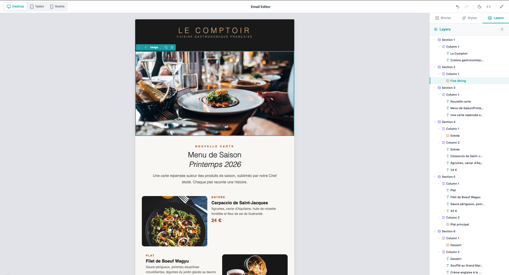
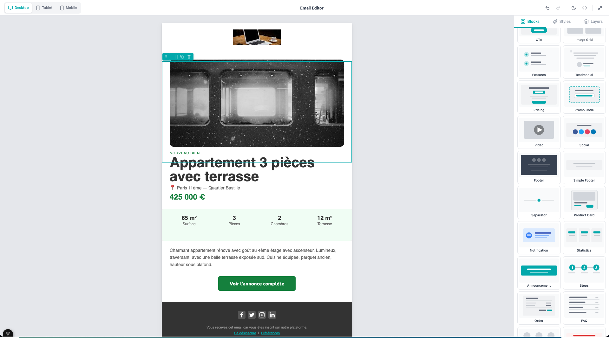
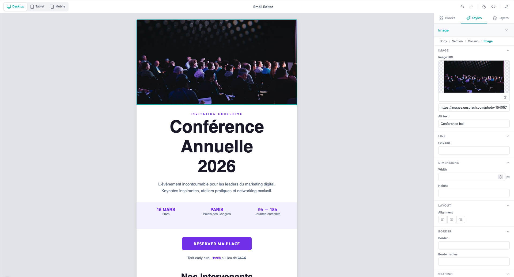
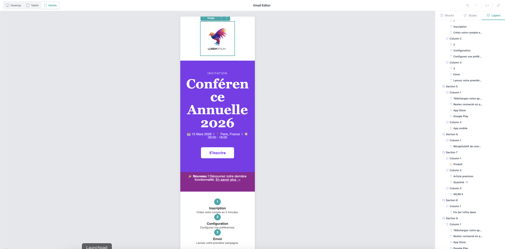

<p align="center">
  
</p>

<h1 align="center">@lab2view/vue-email-editor</h1>

<p align="center">
  <a href="https://www.npmjs.com/package/@lab2view/vue-email-editor"></a>
  <a href="https://github.com/lab2view/vue-email-editor/actions"></a>
  <a href="https://github.com/lab2view/vue-email-editor/blob/main/LICENSE"></a>
  
  
  
</p>

<p align="center">
  A professional, extensible <strong>drag-and-drop</strong> email editor with <strong>AI-assisted editing</strong>, built with <strong>Vue 3</strong> and <strong>MJML</strong>.<br/>
  Design responsive HTML emails visually or let AI generate complete templates from a text description. 43 pre-built blocks, a plugin system, full i18n support, and a complete imperative API.<br/>
  <strong>Free and open-source alternative to Unlayer, Beefree, and Stripo.</strong>
</p>

<p align="center">
  <a href="https://lab2view.github.io/vue-email-editor/#templates"><strong>Try the editor live &rarr;</strong></a>
</p>

## Screenshots

| Blocks & Layout | Ready-made Templates |
|:---:|:---:|
|  |  |

| Property Editing | Layers Panel |
|:---:|:---:|
|  |  |

| AI Chat & Preview |
|:---:|
|  |

## Features

### Visual Drag & Drop Builder
- Intuitive block-based editor with live preview
- Drag blocks from the sidebar onto the canvas
- Reorder and nest elements with visual drop indicators
- Responsive preview in Desktop, Tablet, and Mobile modes
- Iframe-isolated canvas for accurate email rendering

### 43 Pre-built Blocks

| Category | Count | Examples |
|----------|-------|---------|
| **Layout** | 6 | 1-4 columns, sidebar left/right |
| **Content** | 7 | Text, Image, Button, Divider, Spacer, Social, Hero |
| **Composite** | 30 | Header, Hero Banner, Pricing, Testimonial, FAQ, Product Card, Footer, and more |

### Rich Text Editing
Powered by [TipTap](https://tiptap.dev), with inline formatting:
- Bold, Italic, Underline, Strikethrough
- Text alignment (left, center, right)
- Text color picker
- Link insertion and editing

### MJML-Powered Rendering
- Real-time MJML to HTML compilation via [mjml-browser](https://github.com/mjmlio/mjml)
- 13 supported MJML node types
- Export as MJML, compiled HTML, or design JSON
- Legacy GrapesJS format detection for migration

### Undo / Redo
- Full history with keyboard shortcuts (`Ctrl+Z` / `Ctrl+Shift+Z`)
- Reactive `canUndo` / `canRedo` state

### Merge Tags
- Insert dynamic variables into text content (`{{first_name}}`, `{{company}}`, etc.)
- Categorized merge tag picker in the inline toolbar
- Visual chip rendering in the editor
- TipTap extension for atomic merge tag nodes

### Conditional Content
- Show/hide email sections based on merge tag values
- Visual condition builder on any node (variable, operator, value)
- 6 operators: equals, not equals, contains, not contains, exists, not exists
- Exports as HTML conditional comments for ESP processing

### AI Template Generation
- Describe an email in plain language and get a complete, production-ready template
- Built-in AI chat panel with multi-turn conversation for iterative refinement
- Live HTML preview of the generated template before applying
- Streaming support for real-time generation feedback
- Automatic JSON repair for robust parsing of AI responses with auto-retry
- BYOAI (Bring Your Own AI) — plug in OpenAI, Anthropic, or any LLM

### AI Text Generation
- Inline text generation, improvement, shortening, expansion, and translation
- Custom prompt input for freeform generation
- Non-blocking async generation with loading state

### Dark Mode Preview
- Toggle dark mode preview in the toolbar (Moon/Sun icon)
- Simulates email client dark mode behavior in the canvas
- Background inversion, text color adjustment, link color adaptation

### ESP Export Presets
- Export HTML pre-formatted for 6 email service providers
- **Mailchimp**: `*|FNAME|*` merge tags, auto-inject unsubscribe
- **SendGrid**: `{{variable}}` handlebars format
- **Brevo**: `{{ contact.ATTRIBUTE }}` format
- **AWS SES**: `{{camelCase}}` template variables
- **Postmark**: `{{variable}}` Mustache format
- **Resend**: `{{variable}}` format
- Custom preset support for any ESP

### Image Upload
- Drag-and-drop image upload with progress indicator
- Asset browser integration via callback
- File type validation and size limits
- Preview with change/remove actions

### Property Editing
- 40+ editable MJML attributes across 11 property types
- Color pickers, padding controls, alignment selectors
- Global styles panel (email background, default font, preview text)
- Custom fonts support

### 22 Starter Templates
Professional email templates for common use cases: welcome, newsletter, e-commerce, abandoned cart, product launch, shipping notification, birthday, seasonal sale, SaaS onboarding, and more.

---

## Installation

```bash
npm install @lab2view/vue-email-editor
```

**Peer dependencies:**
```bash
npm install vue@^3.4 mjml-browser@^4.15
```

## Quick Start

```vue
<script setup lang="ts">
import { ref } from 'vue'
import { EmailEditor, FR_LABELS } from '@lab2view/vue-email-editor'

const editorRef = ref()
const mjml = ref('')
const html = ref('')
const designJson = ref()
</script>

<template>
  <EmailEditor
    ref="editorRef"
    v-model="mjml"
    :design-json="designJson"
    :labels="FR_LABELS"
    @update:compiled-html="html = $event"
    @update:design-json="designJson = $event"
  />
</template>
```

## Theming

Customize the editor appearance with the `theme` prop:

```vue
<EmailEditor
  :theme="{
    primaryColor: '#7C3AED',
    primaryHover: '#6D28D9',
    borderRadius: '8px',
    fontFamily: 'Inter, sans-serif',
  }"
/>
```

### Available Theme Properties

| Property | Default | Description |
|----------|---------|-------------|
| `primaryColor` | `#01A8AB` | Main accent color |
| `primaryHover` | `#018F91` | Hover state |
| `primaryActive` | `#017375` | Active/pressed state |
| `backgroundColor` | `#ffffff` | Panel backgrounds |
| `borderColor` | `#e5e7eb` | Border color |
| `textPrimary` | `#1f2937` | Primary text |
| `textSecondary` | `#6b7280` | Secondary text |
| `canvasBg` | `#e5e7eb` | Canvas background |
| `selectionColor` | `#01A8AB` | Selected node outline |
| `fontFamily` | System stack | UI font family |
| `fontSize` | `13px` | UI font size |
| `borderRadius` | `6px` | UI border radius |

See `ThemeConfig` in [src/types.ts](src/types.ts) for the full list of 25 properties.

## Internationalization (i18n)

The editor ships with English defaults and a complete French translation. Pass custom labels via the `labels` prop:

```vue
<script setup>
import { EmailEditor, FR_LABELS } from '@lab2view/vue-email-editor'
</script>

<!-- French UI -->
<EmailEditor :labels="FR_LABELS" />

<!-- Custom labels (partial override) -->
<EmailEditor :labels="{ editor_title: 'Mein Editor', undo: 'Ruckgangig' }" />
```

175+ label keys cover all UI elements: toolbar, sidebar tabs, block names, property labels, option values, and status messages. See `EditorLabels` in [src/labels.ts](src/labels.ts).

## Imperative API

Access the editor programmatically via template ref:

```vue
<script setup>
import { ref, onMounted } from 'vue'
import { EmailEditor } from '@lab2view/vue-email-editor'

const editor = ref()

onMounted(() => {
  // Export
  const mjml = editor.value.getMjml()
  const html = editor.value.getHtml()
  const json = editor.value.getDesignJson()

  // History
  editor.value.undo()
  editor.value.redo()

  // Selection
  editor.value.selectNode('node-id')
  const selected = editor.value.getSelectedNode()
  editor.value.clearSelection()

  // Manipulation
  editor.value.deleteNode('node-id')
  editor.value.duplicateNode('node-id')
  editor.value.updateNodeAttribute('node-id', 'color', '#ff0000')

  // Events
  editor.value.on('editor:change', ({ document }) => {
    console.log('Document changed', document)
  })
})
</script>
```

### Full API Reference

| Method | Returns | Description |
|--------|---------|-------------|
| `getDocument()` | `EmailDocument` | Current document tree |
| `setDocument(doc)` | `void` | Replace entire document |
| `getMjml()` | `string` | Export as MJML string |
| `getHtml()` | `string` | Export as compiled HTML |
| `getDesignJson()` | `EmailDesignJson` | Export persisted format |
| `undo()` | `void` | Undo last change |
| `redo()` | `void` | Redo last undone change |
| `canUndo()` | `boolean` | Whether undo is available |
| `canRedo()` | `boolean` | Whether redo is available |
| `selectNode(id)` | `void` | Select a node by ID |
| `getSelectedNode()` | `EmailNode \| null` | Get selected node |
| `clearSelection()` | `void` | Deselect current node |
| `deleteNode(id)` | `void` | Remove a node |
| `duplicateNode(id)` | `NodeId \| null` | Clone a node |
| `insertBlock(block, parentId, index?)` | `NodeId \| null` | Insert a block |
| `updateNodeAttribute(id, key, value)` | `void` | Update an attribute |
| `loadTemplate(doc)` | `void` | Load an EmailDocument |
| `on(event, handler)` | `void` | Subscribe to event |
| `off(event, handler)` | `void` | Unsubscribe from event |

## Events

Subscribe to editor events for real-time notifications:

```ts
editor.value.on('node:selected', ({ nodeId, node }) => {
  console.log('Selected:', node.type)
})

editor.value.on('editor:change', ({ document }) => {
  // Auto-save
  saveToServer(document)
})
```

| Event | Payload | Trigger |
|-------|---------|---------|
| `editor:ready` | `{ document }` | Editor initialized |
| `editor:change` | `{ document }` | Any document change |
| `node:selected` | `{ nodeId, node }` | Node selected |
| `node:deselected` | `{ nodeId }` | Selection cleared |
| `node:deleted` | `{ nodeId }` | Node removed |
| `node:moved` | `{ nodeId, fromParentId, toParentId }` | Node repositioned |
| `node:duplicated` | `{ originalId, newId }` | Node cloned |
| `block:dropped` | `{ blockId, parentId }` | Block added from panel |
| `history:undo` | `{ canUndo, canRedo }` | Undo performed |
| `history:redo` | `{ canUndo, canRedo }` | Redo performed |
| `property:changed` | `{ nodeId, key, value }` | Attribute updated |

## Plugin System

Extend the editor with custom blocks, property editors, toolbar actions, and sidebar panels:

```ts
import type { Plugin } from '@lab2view/vue-email-editor'
import { createText } from '@lab2view/vue-email-editor'

const myPlugin: Plugin = (ctx) => {
  // Add a custom block
  ctx.registerBlock({
    id: 'custom-banner',
    label: 'Custom Banner',
    category: 'content',
    icon: 'Sparkles',
    factory: () => createText('<h1>My Custom Block</h1>', {
      align: 'center',
      'font-size': '24px',
    }),
  })

  // Add a new block category
  ctx.registerBlockCategory({
    id: 'my-category',
    label: 'My Blocks',
    icon: 'Package',
    order: 50,
  })

  // Add a toolbar button
  ctx.registerToolbarAction({
    id: 'save',
    label: 'Save',
    icon: 'Save',
    handler: () => console.log('Saving...'),
    position: 'right',
  })

  // Listen to events
  ctx.on('editor:change', ({ document }) => {
    console.log('Auto-saving...')
  })
}
```

```vue
<EmailEditor :plugins="[myPlugin]" />
```

### Plugin Context API

| Method | Description |
|--------|-------------|
| `registerBlock(block)` | Add a custom block to the blocks panel |
| `registerBlockCategory(category)` | Define a new block category |
| `registerPropertyEditor(type, component)` | Override a property editor component |
| `registerToolbarAction(action)` | Add a button to the toolbar |
| `registerSidebarPanel(panel)` | Add a custom sidebar tab/panel |
| `on(event, handler)` | Subscribe to editor events |
| `off(event, handler)` | Unsubscribe from events |
| `labels` | Reactive reference to current labels |

## Exports

The package provides 35+ exports for advanced usage:

```ts
// Component
import { EmailEditor } from '@lab2view/vue-email-editor'

// Labels & i18n
import { DEFAULT_LABELS, FR_LABELS } from '@lab2view/vue-email-editor'

// Types
import type {
  EmailDocument, EmailNode, EmailDesignJson, EmailEditorAPI,
  Plugin, PluginContext, ThemeConfig, EditorEventMap,
  BlockDefinition, PropertyDefinition,
} from '@lab2view/vue-email-editor'

// Serialization
import { compileMjml, documentToMjml, mjmlToDocument } from '@lab2view/vue-email-editor'

// Node factories
import {
  createDefaultDocument, createSection, createColumn,
  createText, createImage, createButton, createDivider,
  createSpacer, createSocial, createHero, createWrapper,
} from '@lab2view/vue-email-editor'

// Tree utilities
import { findNode, findParent, removeNode, moveNode, cloneSubtree } from '@lab2view/vue-email-editor'

// Constants
import {
  DEFAULT_THEME, STATIC_BLOCKS,
  CONTENT_NODE_TYPES, CONTAINER_NODE_TYPES, SELF_CLOSING_NODE_TYPES,
} from '@lab2view/vue-email-editor'

// ESP Export Presets
import {
  exportForEsp, exportForMailchimp, exportForSendGrid,
  exportForBrevo, exportForAwsSes, exportForPostmark, exportForResend,
  ESP_PRESETS, MAILCHIMP_PRESET, SENDGRID_PRESET,
} from '@lab2view/vue-email-editor'
```

## Keyboard Shortcuts

| Shortcut | Action |
|----------|--------|
| `Ctrl+Z` | Undo |
| `Ctrl+Shift+Z` | Redo |
| `Ctrl+D` | Duplicate selected node |
| `Delete` / `Backspace` | Delete selected node |
| `Escape` | Deselect / close inline editor |

## Props

| Prop | Type | Default | Description |
|------|------|---------|-------------|
| `modelValue` | `string` | `''` | MJML content (v-model) |
| `designJson` | `Record<string, unknown>` | — | Persisted design JSON |
| `variables` | `string[]` | `[]` | Available merge variables |
| `labels` | `Partial<EditorLabels>` | `DEFAULT_LABELS` | i18n label overrides |
| `label` | `string` | — | Form field label |
| `required` | `boolean` | `false` | Form validation flag |
| `theme` | `Partial<ThemeConfig>` | `DEFAULT_THEME` | Visual customization |
| `plugins` | `Plugin[]` | `[]` | Editor extensions |
| `mergeTags` | `MergeTag[]` | — | Dynamic variable tags |
| `aiProvider` | `AiProvider` | — | AI template generation and inline text callbacks |
| `onImageUpload` | `(file: File) => Promise<{ url }>` | — | Image upload handler |
| `onBrowseAssets` | `() => Promise<string \| null>` | — | Asset browser handler |

## Merge Tags

Insert dynamic content with merge tag variables:

```vue
<EmailEditor
  :merge-tags="[
    { name: 'First Name', value: '{{first_name}}', category: 'Contact' },
    { name: 'Company', value: '{{company}}', category: 'Contact' },
    { name: 'Unsubscribe', value: '{{unsubscribe_url}}', category: 'Links' },
  ]"
/>
```

## AI Template Generation

Generate complete email templates from natural language. Plug in any LLM — OpenAI, Anthropic, Google Gemini, or your own.

```vue
<script setup lang="ts">
import { ref } from 'vue'
import { EmailEditor } from '@lab2view/vue-email-editor'
import type { AiProvider } from '@lab2view/vue-email-editor'

const mjml = ref('')

const aiProvider: AiProvider = {
  generateText: async (prompt, context) => {
    const res = await fetch('/api/ai/text', {
      method: 'POST',
      headers: { 'Content-Type': 'application/json' },
      body: JSON.stringify({ prompt, context }),
    })
    return (await res.json()).text
  },
  generateTemplate: async (messages, systemPrompt) => {
    const res = await fetch('/api/ai/chat', {
      method: 'POST',
      headers: { 'Content-Type': 'application/json' },
      body: JSON.stringify({ messages, systemPrompt }),
    })
    return (await res.json()).content
  },
}
</script>

<template>
  <EmailEditor v-model="mjml" :ai-provider="aiProvider" />
</template>
```

Your backend just forwards to any LLM and returns the raw response. The editor handles JSON parsing, repair, and retry automatically.

**Want to test without an API key?** Use the [mock provider](https://lab2view.github.io/vue-email-editor/guide/ai#mock-provider-for-testing) — a static `AiProvider` that returns dummy responses for development and testing.

**[Full AI integration guide →](https://lab2view.github.io/vue-email-editor/guide/ai)** — complete backend examples for OpenAI, Anthropic, and Google Gemini, streaming setup, error handling, and more.

## ESP Export

Export HTML pre-formatted for your email service provider:

```ts
import {
  exportForMailchimp,
  exportForSendGrid,
  exportForBrevo,
  exportForAwsSes,
  exportForEsp,
} from '@lab2view/vue-email-editor'

// Get the document from the editor
const document = editorRef.value.getDocument()

// Export for Mailchimp (transforms {{first_name}} → *|FNAME|*)
const { html, mjml } = await exportForMailchimp(document)

// Export for SendGrid
const result = await exportForSendGrid(document)

// Export with custom merge tag mappings
const custom = await exportForEsp(document, 'brevo', {
  mergeTags: { plan_name: '{{ contact.PLAN }}' },
})
```

## Development

```bash
# Type check
npm run typecheck

# Run tests (147 tests)
npm test

# Build library
npm run build
```

## Tech Stack

- **[Vue 3](https://vuejs.org)** — Reactive component framework
- **[MJML](https://mjml.io)** — Email markup language
- **[TipTap](https://tiptap.dev)** — Rich text editing
- **[Lucide](https://lucide.dev)** — Icon system (400+ icons)
- **[VueUse](https://vueuse.org)** — Vue composable utilities
- **[TypeScript](https://www.typescriptlang.org)** — Full type safety
- **[Vite](https://vite.dev)** — Build tooling
- **[Vitest](https://vitest.dev)** — Testing framework

## License

[MIT](LICENSE)
